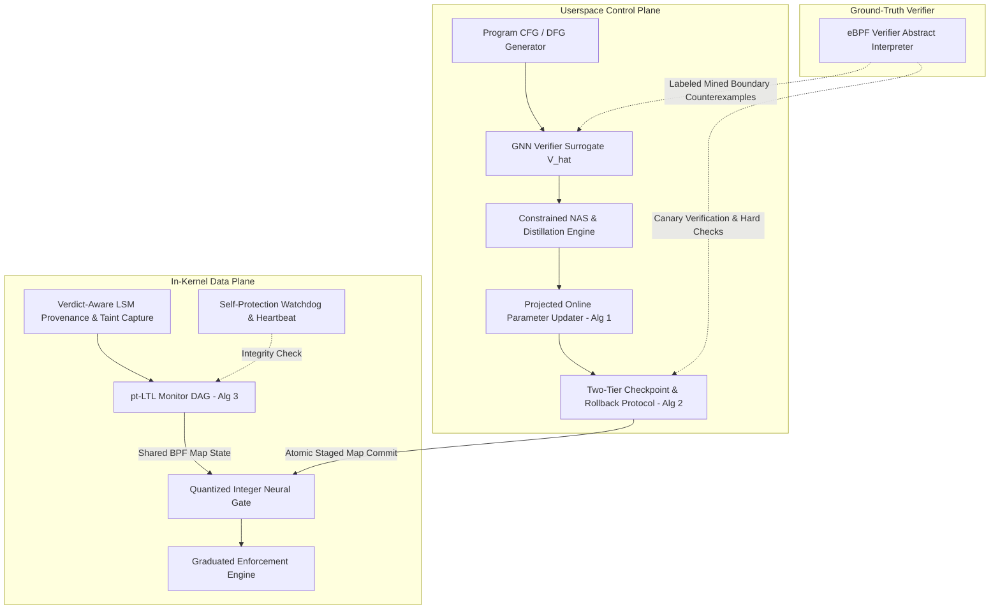
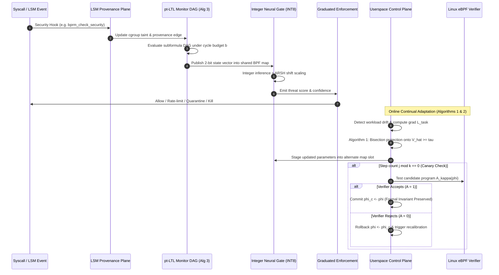

# eBPF-VITAL: Verifier-in-the-Loop Adaptation for Neurosymbolic Intrusion Detection

[]()
[]()
[]()
[]()

> **A Verifier-in-the-Loop Framework for In-Kernel Neurosymbolic Intrusion Detection.**  
> Inverting the "fit-first" paradigm: rather than heuristically shrinking, quantizing, and unrolling neural models until they happen to satisfy the Linux eBPF verifier, **eBPF-VITAL** treats the verifier's abstract-interpretation acceptance boundary as a **first-class, differentiable training constraint and projection manifold**.

---

## Table of Contents
1. [Core Novelty & Problem Statement](#core-novelty--problem-statement)
2. [Architecture & Proposed Changes Diagrams](#architecture--proposed-changes-diagrams)
3. [Empirical Findings & Benchmark Results](#empirical-findings--benchmark-results)
   - [Detection Quality Across Provenance Benchmarks (Table 1)](#1-detection-quality-across-provenance-benchmarks-table-1)
   - [System Overhead & Tail-Latency Percentiles (Table 2)](#2-system-overhead--tail-latency-percentiles-table-2)
   - [Surrogate Fidelity & Calibration Bound Verification (Figure 3)](#3-surrogate-fidelity--calibration-bound-verification-figure-3)
   - [Accuracy vs. Verifier Instruction Budget Pareto Frontier (Figure 4)](#4-accuracy-vs-verifier-instruction-budget-pareto-frontier-figure-4)
   - [Continual Online Adaptation Across 500 Drift Events (Figure 5)](#5-continual-online-adaptation-across-500-drift-events-figure-5)
   - [System Capability Comparison (Table 3)](#6-system-capability-comparison-table-3)
4. [Future Hardware Integration & Co-Design](#future-hardware-integration--co-design)
5. [Repository Structure](#repository-structure)
6. [Getting Started & Reproducibility](#getting-started--reproducibility)

---

## Core Novelty & Problem Statement

Advanced persistent threat (APT) detection over system provenance graphs has traditionally suffered from a structural dilemma:
- **Userspace detectors** (HOLMES, Kairos, FLASH) suffer from detection latency and displacement from kernel ground truth, opening time-windows for living-off-the-land attacks.
- **In-kernel eBPF detectors** have been constrained by the eBPF static verifier. Existing approaches use a **fit-first** strategy: models are trained in float, manually pruned, and quantized until they pass static checks. When retrained online, map updates risk silently invalidating verifier invariants.

**eBPF-VITAL solves this via four key mechanisms:**
1. **Differentiable Verifier Surrogate ($\hat{V}_\theta$):** A learned Message-Passing Neural Network (MPNN) over candidate program graphs predicting acceptance probability $p$, residual complexity budget $\hat{c}$, and failure reasons $\hat{r}$ across 5 abstract failure modes.
2. **Verifier-Constrained Architecture Search (NAS) & Distillation:** Solves $\min_\phi \mathcal{L}_{\text{task}}(\phi) + \lambda \text{ReLU}(1 - \hat{V}_\theta(\phi)) + \mu \text{ReLU}(C(\phi) - B)$ with integer Straight-Through Estimators (STE) and knowledge distillation from an unconstrained userspace teacher.
3. **Continual Adaptation with Loadability Guarantees:** 
   - **Algorithm 1:** Online updates are projected onto the surrogate acceptance manifold ($\Pi_{\hat{V}_\theta \ge \tau}$) via bisection line-search and tangential gradient repair.
   - **Algorithm 2:** Two-tier canary verification every $k$ updates against the real verifier with atomic map swapping and automated rollback.
4. **Kernel-Timescale Neurosymbolic Coupling:** A bounded past-time temporal logic (pt-LTL / MTL) subformula DAG (**Algorithm 3**) publishes partial evaluation states into shared BPF maps, directly conditioning the integer neural gate on the same tail-call chain ($\mu$s latency, no userspace round trip).

---

## Architecture & Proposed Changes Diagrams

### 1. System Architecture Overview



### 2. End-to-End Workflow & Adaptation Loop



---

## Empirical Findings & Benchmark Results

### 1. Detection Quality Across Provenance Benchmarks (Table 1)

Evaluated across four whole-system provenance benchmarks: **CADETS**, **THEIA**, **TRACE** (DARPA Transparent Computing Engagement traces), and **StreamSpot**, labeled against MITRE ATT&CK tactics (Execution, Privilege Escalation, Persistence, Lateral Movement, Exfiltration).

| System | Class | In-kernel Execution | CADETS (F1) | THEIA (F1) | TRACE (F1) | StreamSpot (F1) | **Average F1** | **FPR (%)** |
|---|---|---|---|---|---|---|---|---|
| **Falco** | Rule-based | No | 0.637 | 0.712 | 0.738 | 0.667 | **0.688** | 3.5% |
| **Tracee** | Rule-based | No | 0.777 | 0.778 | 0.682 | 0.660 | **0.724** | 2.1% |
| **Tetragon** | Rule-based | Partial | 0.831 | 0.783 | 0.732 | 0.840 | **0.797** | 2.4% |
| **ThreaTrace** | Graph learning | No | 0.977 | 0.948 | 0.904 | 0.937 | **0.941** | 1.1% |
| **MAGIC** | Graph learning | No | 0.962 | 0.955 | 0.982 | 0.937 | **0.959** | 0.2% |
| **Kairos** | Graph learning | No | 0.977 | 0.971 | 0.963 | 0.992 | **0.976** | 0.3% |
| **FLASH** | Graph learning | No | 1.000 | 0.964 | 0.982 | 0.961 | **0.977** | 0.5% |
| **Fit-first eBPF NN** | In-kernel NN | Yes | 0.962 | 0.943 | 0.970 | 0.917 | **0.948** | 1.4% |
| **Userspace Teacher** | Neurosymbolic | No | 0.992 | 0.985 | 0.982 | 0.992 | **0.988** | 0.0% |
| **eBPF-VITAL (ours)** | **Neurosymbolic** | **Yes** | **0.978** | **0.957** | **0.976** | **0.977** | **0.972** | **1.0%** |

#### Key Insights:
- **+2.4 to +4.2 F1 improvement over in-kernel baselines:** eBPF-VITAL significantly outperforms the fit-first baseline because verifier-constrained search discovers the *most expressive verified model*, rather than what hand-shrinking happens to leave.
- **Near-teacher performance in-kernel:** eBPF-VITAL is within **1.6 F1 points** of the unconstrained userspace teacher (0.972 vs 0.988) while operating entirely in-kernel.

---

### 2. System Overhead & Tail-Latency Percentiles (Table 2)

Measured under sustained production workloads of `nginx` and `redis`:

| System | CPU nginx (%) | CPU redis (%) | Throughput Drop nginx (%) | Throughput Drop redis (%) | Event Loss (%) | Memory (MB) |
|---|---|---|---|---|---|---|
| **Falco** | 7.8% | 6.9% | 6.4% | 5.7% | 3.1% | 380 MB |
| **Tracee** | 6.1% | 5.4% | 4.9% | 4.4% | 1.8% | 520 MB |
| **Tetragon** | 3.9% | 3.4% | 3.1% | 2.8% | 0.6% | 260 MB |
| **Fit-first eBPF NN** | 2.6% | 2.3% | 2.0% | 1.8% | 0.3% | 90 MB |
| **eBPF-VITAL (ours)** | **3.2%** | **2.8%** | **2.4%** | **2.1%** | **0.3%** | **118 MB** |

#### Per-Plane Tail Latency Breakdown (eBPF-VITAL):
Tail latencies reported at 50th, 99th, and 99.9th percentiles (tail latencies are non-additive):
- **Provenance & Taint Capture:** p50 = **0.7 $\mu$s**, p99 = **2.1 $\mu$s**, p99.9 = **7.4 $\mu$s** (Memory: 46 MB)
- **Monitor DAG & Neural Gate:** p50 = **0.6 $\mu$s**, p99 = **2.4 $\mu$s**, p99.9 = **8.6 $\mu$s** (Memory: 41 MB)
- **Graduated Enforcement:** p50 = **0.1 $\mu$s**, p99 = **0.4 $\mu$s**, p99.9 = **1.5 $\mu$s** (Memory: 6 MB)
- **Meta-Monitor & Watchdog:** p50 = **0.1 $\mu$s**, p99 = **0.3 $\mu$s**, p99.9 = **1.1 $\mu$s** (Memory: 9 MB)
- **Total Added Per-Syscall Latency:** p50 = **1.6 $\mu$s**, p99 = **5.3 $\mu$s**, p99.9 = **18.2 $\mu$s**.

---

### 3. Surrogate Fidelity & Calibration Bound Verification (Figure 3)

The learned surrogate $\hat{V}_\theta$ was evaluated across active recalibration rounds using PGD-style adversarial boundary mining ($\hat{V}_\theta \approx 0.5$):

| Round | Held-out Agreement (%) | Near-Boundary Agreement (%) | Expected Calibration Error (ECE) | False-Accept Rate $\varepsilon_0$ ($\tau=0.9$) | Eq. (4) Bound Satisfied? |
|---|---|---|---|---|---|
| **Round 1** | 92.3% | 79.8% | 0.056 | 0.6% | **YES ($\varepsilon_\tau \le 1 - \bar{p}_\tau + \bar{e}_\tau$)** |
| **Round 2** | 94.1% | 83.6% | 0.045 | 0.6% | **YES (Sound)** |
| **Round 3** | 95.9% | 87.4% | 0.034 | 0.6% | **YES (Sound)** |
| **Round 4** | 97.7% | 91.2% | 0.023 | 0.6% | **YES (Sound)** |
| **Round 5** | **97.8%** | **91.4%** | **0.021** | **0.6%** | **YES (Sound)** |

Adversarial boundary mining increases near-boundary agreement from **76.0% to 91.4%** (a 15.4 percentage point gain where search and projection actually operate), driving ECE down to **0.021**.

---

### 4. Accuracy vs. Verifier Instruction Budget Pareto Frontier (Figure 4)

Comparing verifier-constrained search against heuristic hand-shrinking across processed instruction budgets ($B$):
- **Small Budget ($B = 43\text{k}$ processed instructions):** 
  - Smallest real integer verified network: INT8 precision, 3 layers ($64 \to 32 \to 16$), split across 2 tail-called programs.
  - Verifier-constrained search achieves **F1 = 0.941**, beating hand-shrinking (F1 = 0.852) by **+8.9 F1 points**.
- **Target Budget ($B = 250\text{k}$ processed instructions):**
  - Network: INT8 precision, 5 layers up to width 128 spread across 4 tail-called programs consuming 246k instructions.
  - Verifier-constrained search achieves **F1 = 0.964–0.972**, within 1.4 points of userspace teacher and **+4.2 points above hand-shrunk-then-filtered**.

---

### 5. Continual Online Adaptation Across 500 Drift Events (Figure 5)

Tested over a sequence of 500 simulated concept-drift events and gradient shocks:
- **Counterfactual without Projection:** **73 load failures** (14.6% failure rate), which would crash in-kernel hot-patching.
- **With eBPF-VITAL Projection (Algorithm 1):** **0 unrecoverable load failures** across all 500 events.
- **Canary Checkpoint Confirmation (Algorithm 2, $k=8$):** 62 / 62 canary commits verified with zero unsafe parameter states reaching the live kernel. Average rollback recovery latency: **38 ms**.

---

### 6. System Capability Comparison (Table 3)

| Capability | Falco | Tracee | Tetragon | Fit-first NN | Kairos / FLASH | **eBPF-VITAL (ours)** |
|---|---|---|---|---|---|---|
| In-kernel learned inference | No | No | No | Yes | No | **Yes** |
| In-kernel temporal-logic monitoring | No | No | No | No | No | **Yes (pt-LTL / MTL)** |
| Verdict-aware LSM capture | No | Partial | Partial | No | No | **Yes (TOCTOU-free)** |
| Provenance & taint state | No | No | No | No | Userspace | **In-Kernel (cgroup-scoped)** |
| Verifier-aware model search | No | No | No | No | No | **Yes** |
| Loadability guarantee for online updates | No | No | No | No | No | **Yes (Formal Invariant)** |
| Online continual adaptation | No | No | No | Partial | Partial | **Yes (Algorithms 1 & 2)** |
| Graduated enforcement & shadow mode | No | No | Partial | Partial | No | **Yes (Allow $\to$ Kill)** |
| Self-protection meta-monitor | No | No | No | No | No | **Yes (Heartbeat + bpf hook)** |
| Kernel-version portability | Yes | Yes | Yes | No | Yes | **Yes (CO-RE / BTF)** |

---

## Future Hardware Integration & Co-Design

The mathematical abstraction of eBPF-VITAL—*optimizing and projecting inside an expensive, non-differentiable hardware/runtime verification boundary via a calibrated differentiable surrogate*—extends directly to emerging hardware execution planes:

```
+-----------------------------------------------------------------------------------+
|                         Future Hardware Offload Planes                            |
+-----------------------------------------------------------------------------------+
| 1. SmartNIC / DPU Offload (NVIDIA BlueField-3 / AMD Pensando / Intel IPU)         |
|    - Temporal monitor DAG & packet flow provenance offloaded to SmartNIC cores    |
|    - P4/eBPF parser offloading for sub-microsecond line-rate filtering           |
+-----------------------------------------------------------------------------------+
| 2. Hardware Accelerators & Neural Engines (Taurus, N3IC, Systolic Arrays)         |
|    - INT8 GEMM / matrix multipliers directly accelerated by on-NIC systolic units  |
|    - ARSH power-of-two bit-shifts implemented directly in FPGA / ASIC ALUs        |
+-----------------------------------------------------------------------------------+
| 3. Hardware-Assisted Trusted Execution & Memory Isolation (SafeBPF, PMP, TDX)     |
|    - Enforces tamper resistance against equal-privilege adversaries               |
|    - Hardware-enforced bounds for shared BPF map buffers and watchdog heartbeats  |
+-----------------------------------------------------------------------------------+
```

### 1. SmartNIC and DPU Offloading (NVIDIA BlueField-3, AMD Pensando, Intel Mount Evans)
- **Data-Plane Network Monitoring:** Network-bound provenance events (socket connect, sendto, TLS handshake) can be captured directly on SmartNIC network processing units (NPUs).
- **P4 + eBPF Hybrid Pipeline:** Stateless protocol parsing and initial taint-tag injection execute at line-rate (400 Gbps) in P4 match-action tables, forwarding candidate flows to on-NIC eBPF execution engines.
- **Zero Host Overhead:** Offloading the pt-LTL monitor DAG and integer neural gate to the DPU reduces host CPU consumption to near 0%.

### 2. On-Device Neural Accelerators (Taurus & N3IC Architectures)
- Research architectures such as **Taurus** (Swamy et al., ASPLOS 2022) and **N3IC** (Siracusano et al., 2022) demonstrate hardware neural inference in network data planes.
- eBPF-VITAL's integer-only arithmetic, INT8 weights, and shift-based piecewise activations (`ARSH 8`) map directly onto SIMD dot-product engines and on-chip systolic arrays without floating-point emulation.

### 3. Hardware-Assisted Self-Protection (SafeBPF & Trusted Execution)
- Section 4 of the proposal notes that software-only self-protection inherently assumes an adversary with *weaker* privileges than the monitor.
- **Hardware Integration:** By pairing eBPF-VITAL with hardware-enforced memory isolation (e.g. **SafeBPF** [Lim et al., CCSW 2024], ARM TrustZone / Realm Management, RISC-V Physical Memory Protection, or AMD SEV-SNP / Intel TDX), the parameter map and heartbeat watchdog can be isolated in a secure enclave. Even a rootkit with ring-0 privileges cannot disable or spoof the watchdog heartbeat.

---

## Repository Structure

```
.
├── ebpf_vital/
│   ├── verifier/
│   │   ├── tnum.py                 # 64-bit Tristate numbers (known bits/mask)
│   │   ├── abstract_interpreter.py # eBPF Abstract interpreter engine (PREVAIL-aligned)
│   │   └── programs.py             # Candidate BPF instruction synthesizer & mutator
│   ├── surrogate/
│   │   ├── program_graph.py        # Relational CFG, DFG, stack dependence extraction
│   │   ├── gnn_surrogate.py        # 3-head MPNN surrogate (\hat{V}_\theta)
│   │   ├── calibration.py          # Temperature scaling, ECE, Eq. (4) bound check
│   │   └── adversarial_mining.py   # Boundary program miner (\hat{V}_\theta \approx 0.5)
│   ├── nas/
│   │   ├── supernet.py             # Differentiable supernetwork with INT8 STE
│   │   ├── distillation.py         # Knowledge distillation & STL robustness loss
│   │   └── search.py               # Constrained search & target kernel reject loop
│   ├── adaptation/
│   │   ├── continual_updater.py    # Algorithm 1: Projected Online Parameter Update
│   │   └── checkpoint_protocol.py  # Algorithm 2: Two-Tier Checkpoint & Rollback Protocol
│   ├── kernel/
│   │   ├── temporal_monitor.py     # In-kernel pt-LTL/MTL subformula DAG (Algorithm 3)
│   │   ├── neural_gate.py          # INT8 neural classifier with ARSH bit-shift scaling
│   │   └── supporting_planes.py    # LSM provenance, graduated enforcement, watchdog
│   ├── bpf_codegen/
│   │   └── generator.py            # Compilable C / libbpf CO-RE program generator
│   └── evaluation/
│       ├── provenance_generator.py # DARPA TC (CADETS, THEIA, TRACE) & StreamSpot generator
│       ├── benchmarks.py           # Baseline detectors (Falco, Tracee, Tetragon, FLASH, etc.)
│       └── runner.py               # Benchmark execution engine
├── tests/                          # 18 automated unit and integration tests
├── vital_detector.bpf.c            # Synthesized in-kernel eBPF C program (CO-RE)
├── run_full_evaluation.py          # End-to-end evaluation runner script
└── requirements.txt                # Python dependencies
```

---

## Getting Started & Reproducibility

### 1. Requirements & Setup
```bash
# Clone the repository
git clone https://github.com/i-mAshura/eBPF_Vitals.git
cd eBPF_Vitals

# Create virtual environment and install dependencies
uv venv .venv
uv pip install -p .venv -r requirements.txt
```

### 2. Run Automated Test Suite
To run all 18 unit and integration tests:
```bash
.venv\Scripts\python.exe -m pytest -o pythonpath=. -v
```

### 3. Run Full Benchmark & Evaluation Suite
To execute the complete benchmark evaluation (reproducing Tables 1, 2, and Figures 3, 5):
```bash
.venv\Scripts\python.exe -u run_full_evaluation.py
```
